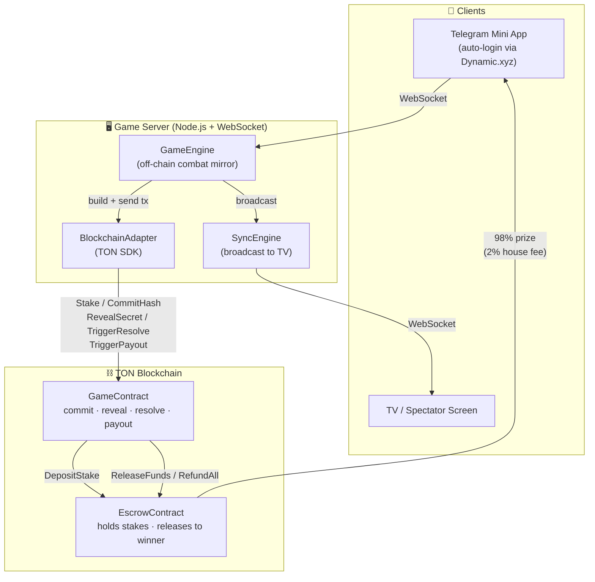
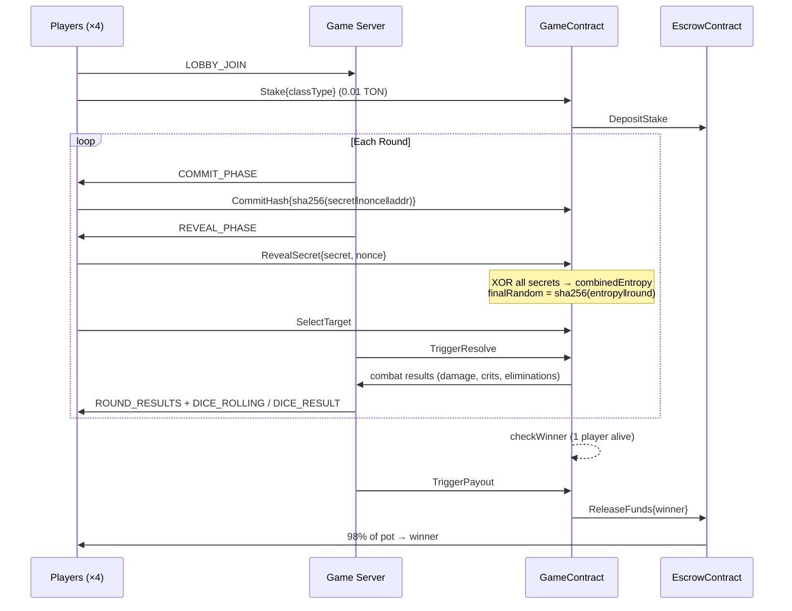

# TonGames

On-chain PvP arena game on the TON blockchain. Players commit-reveal dice rolls to battle, with spectator betting and smart contract escrow.

## Deployed Contracts (Testnet)

| Contract | Address |
|----------|---------|
| GameContract | [`EQCJRyGAv8p9z2Cq_0G54U1fq3bc3UZnlsBUtZOGRDgfMN_I`](https://testnet.tonscan.org/address/EQCJRyGAv8p9z2Cq_0G54U1fq3bc3UZnlsBUtZOGRDgfMN_I) |
| EscrowContract | [`EQBVcvwGfb31t86hMA_zDqmpJymybADjCmo0cfTfnonL2pO-`](https://testnet.tonscan.org/address/EQBVcvwGfb31t86hMA_zDqmpJymybADjCmo0cfTfnonL2pO-) |

- **Network:** Testnet
- **Stake amount:** 0.01 TON (100,000,000 nanoTON)
- **Max players:** 4
- **Owner:** `UQBc3bogyzi1ZwPZFO3wyaCgYOEq8pZNqQ6OIr9cNYSNLz95`
- **Deployed at:** 2026-03-21T22:17:24Z

## Project Structure

```
contracts/       Tact smart contracts (GameContract, EscrowContract)
frontend/        Next.js app (Tailwind, Dynamic.xyz, TON Connect through Dynamic.xyz)
server/          Node.js WebSocket game server
telegram_bot/    Telegram bot for mini app auth & lobby links
```

## Architecture



## Game Flow



## Stack

- **Frontend:** Next.js · Tailwind CSS · Dynamic.xyz auth · TON Connect
- **Backend:** Node.js WebSocket server with commit-reveal game engine
- **Contracts:** Tact (TON) — GameContract + EscrowContract with spectator betting
- **Auth:** Telegram Mini App (auto-login via Dynamic.xyz `telegramSignIn`)
